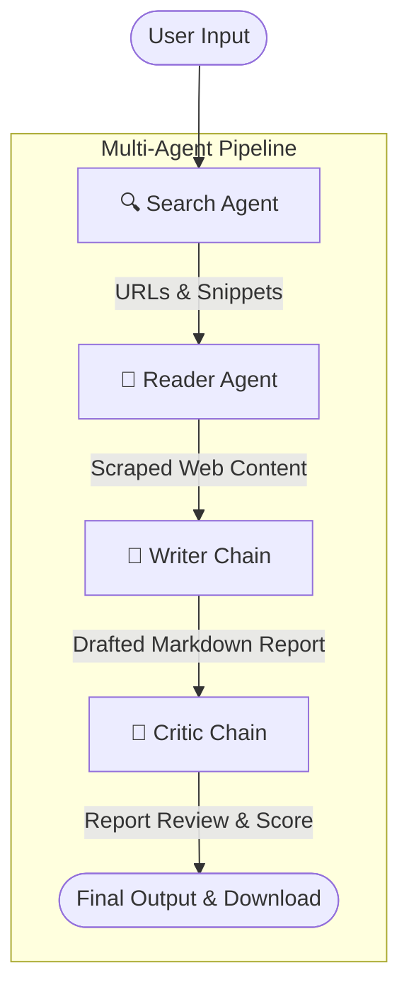

# 🔬 ResearchMinds: Multi-Agent AI Research System


**ResearchMind** is an autonomous, multi-agent AI pipeline designed to conduct deep research on any topic. Given a simple prompt, four specialized AI agents collaborate to search the web, scrape deep content, draft a comprehensive report, and critically review the final output.

The frontend is powered by a sleek, custom-styled Streamlit interface featuring real-time progress tracking and a beautiful dark-mode aesthetic.

---

## 🌟 Key Features

- **🕵️‍♂️ Search Agent:** Utilizes the Tavily Search API to gather the top 5 most recent and relevant sources for a given query.
- **📄 Reader Agent:** Autonomously selects the most relevant URL from the search results, bypasses basic anti-scraping blockers, and extracts clean, readable text.
- **✍️ Writer Chain:** Synthesizes the gathered intelligence into a well-structured markdown report, complete with Introductions, Key Findings, and Sources.
- **🧐 Critic Chain:** Acts as a strict peer-reviewer, scoring the drafted report out of 10 and offering constructive feedback (Strengths & Areas to Improve).
- **✨ Beautiful UI:** A fully custom Streamlit frontend overriding default styles for a premium, startup-like feel.

---

## 🏗️ Architecture



---

## ⚙️ Tech Stack

- **Frontend:** [Streamlit](https://streamlit.io/) (with custom CSS injection)
- **Orchestration:** [LangChain](https://python.langchain.com/)
- **LLM Engine:** [Mistral AI](https://mistral.ai/) (`ministral-8b-2512`)
- **Web Search:** [Tavily API](https://tavily.com/)
- **Web Scraping:** Beautiful Soup 4 + Requests

---

## 🚀 Installation & Setup

### 1. Clone the repository

```bash
git clone https://github.com/yourusername/Multi-agent-research-system.git
cd Multi-agent-research-system
```

### 2. Create a virtual environment (Recommended)

```bash
python -m venv .venv
# Windows
.venv\Scripts\activate
# macOS/Linux
source .venv/bin/activate
```

### 3. Install dependencies

```bash
pip install -r requirements.txt
```

### 4. Configure Environment Variables

Create a `.env` file in the root directory and add your API keys:

```env
MISTRAL_API_KEY=your_mistral_api_key_here
TAVILY_API_KEY=your_tavily_api_key_here
```

_(Note: If you plan to switch the LLM back to OpenAI, you can also add `OPENAI_API_KEY` and update `agents.py` accordingly)._

---

## 💻 Usage

Run the Streamlit application locally:

```bash
streamlit run app.py
```

The application will launch in your default web browser (usually at `http://localhost:8501`). Enter a topic, click "Run Research Pipeline", and watch the agents work!

---

## 🌐 Deployment

The easiest way to deploy this application for free is using **Streamlit Community Cloud**:

1. Push this repository to a public (or private) GitHub repository.
2. Go to [share.streamlit.io](https://share.streamlit.io/).
3. Connect your GitHub account and select this repository.
4. Set the main file path to `app.py`.
5. Under **Advanced Settings**, add your `MISTRAL_API_KEY` and `TAVILY_API_KEY` as Secrets.
6. Click **Deploy!**

---

## 🤝 Contributing

Contributions, issues, and feature requests are welcome! Feel free to check the [issues page](https://github.com/yourusername/Multi-agent-research-system/issues).

## 📝 License

This project is [MIT](https://choosealicense.com/licenses/mit/) licensed.
